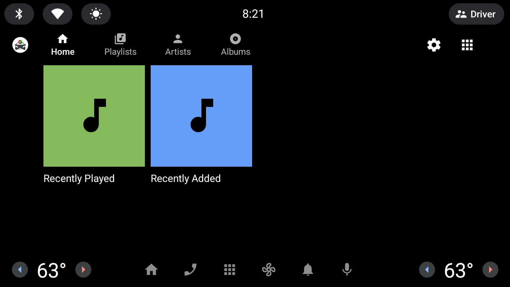
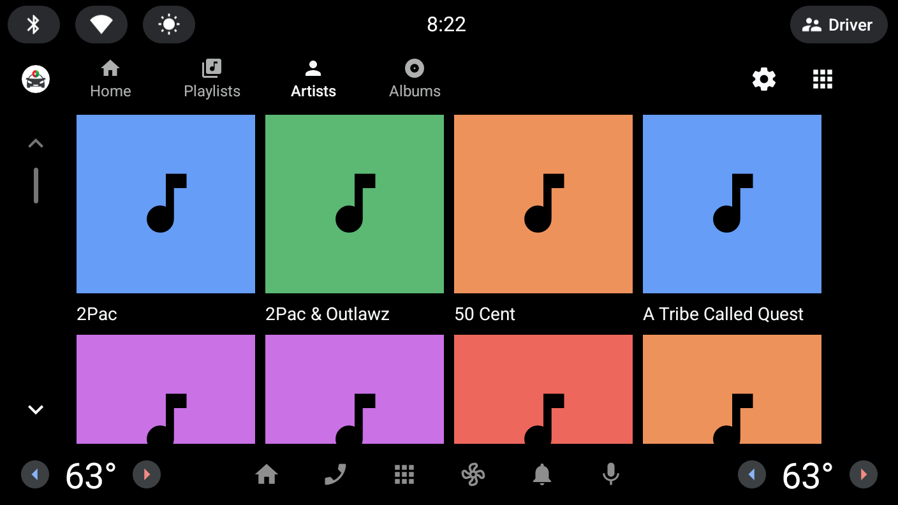
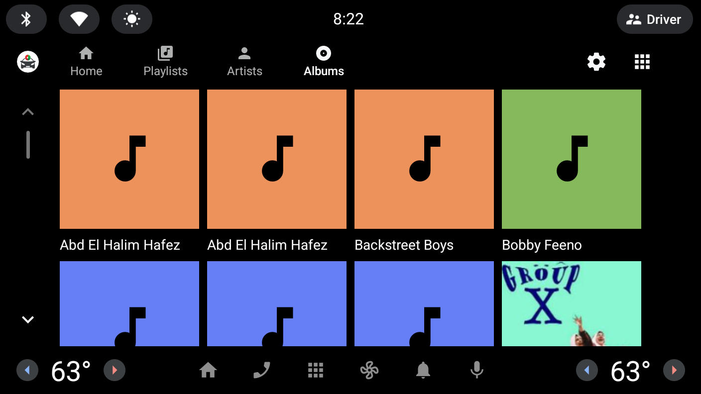
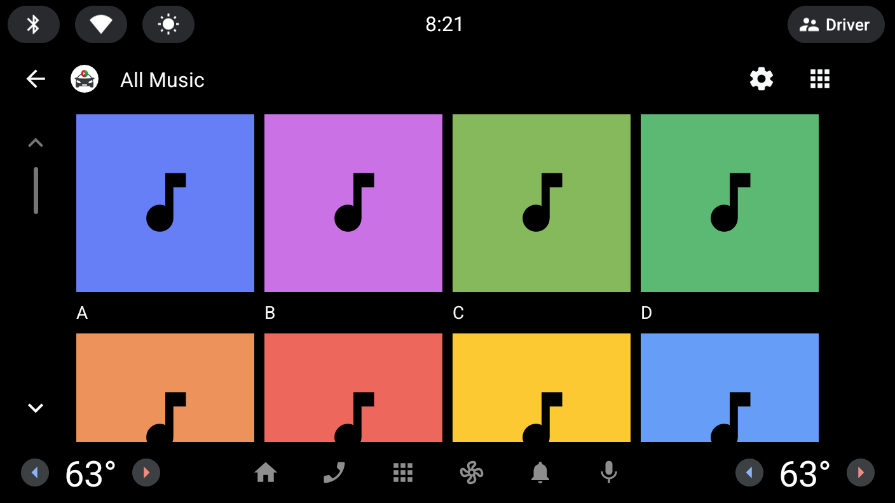

# Plexamp for Android Automotive

A Plex music client for Android Automotive OS.

## Features

### Music Browsing
- **Home** - Quick access to Recently Played tracks and Recently Added albums
- **Playlists** - Browse and play your Plex playlists (large playlists grouped alphabetically)
- **Artists** - Browse all artists, view their albums, and play tracks
- **Albums** - Browse all albums and play tracks

### Playback
- Background playback with media notification
- Shuffle and repeat modes (persisted between sessions)
- Resume playback from last position
- Track prefetching for seamless playback

### Offline Support
- Automatic caching of recently played tracks
- Works with intermittent connectivity

## Browse Hierarchy

```
Root
├── Home
│   ├── Recently Played → Tracks
│   └── Recently Added → Albums → Tracks
├── Playlists
│   └── [Playlist] → [A-Z groups] → Tracks
├── Artists
│   └── [Artist] → [Albums] → Tracks
└── Albums
    └── [Album] → Tracks
```

## Screenshots

| Home | Artists |
|------|---------|
|  |  |

| Albums | All Music |
|--------|-----------|
|  |  |

## Requirements

- Android Automotive OS (Android 10+)
- Plex Media Server with music library
- Plex account

## Changelog

### v1.0.0
- Rebranded as Plexamp for AAOS
- New package name: `us.tiba.plexamp`
- Now uses JitPack for API dependency

### v0.8.0
- Added Home tab with Recently Played and Recently Added sections
- Added Artists browsing - view all artists, their albums, and tracks
- Added Albums browsing - view all albums and their tracks
- Large playlists now grouped alphabetically
- New icons for browse categories

### v0.7.2
- Artist name now uses `originalTitle` if present

### v0.7.1
- Remember shuffle and repeat modes between sessions

### v0.7.0
- Added offline playback support
- Track prefetching for better streaming experience

## Building

### Prerequisites

1. Clone this repository
2. Create `local.properties` in the root with:
   ```properties
   sdk.dir=/path/to/Android/sdk
   # Optional for release builds:
   # signing_key_path=/path/to/keystore.jks
   # signing_key_password=your-password
   # signing_key_alias=your-alias
   ```

### Build

```bash
./gradlew assembleDebug
# or for release:
./gradlew assembleRelease
```

### Install on Emulator

```bash
./gradlew :automotive:installDebug
```

## Dependencies

- [plexamp-for-aaos-api](https://github.com/hamoudydev/plexamp-for-aaos-api) - Plex API client library (via JitPack)
- ExoPlayer - Media playback
- Glide - Image loading

## License

MIT License

Based on original work by Joey Berkovitz.

## Author

Hamoudy Tiba

## Contributing

Contributions are welcome! Please feel free to submit a Pull Request.
